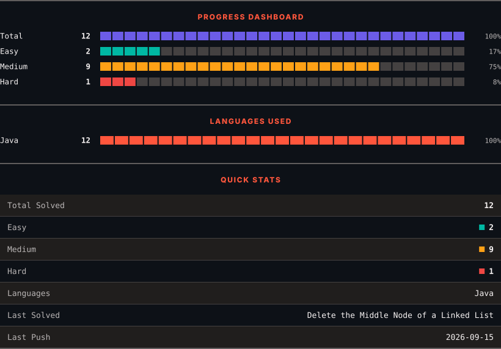
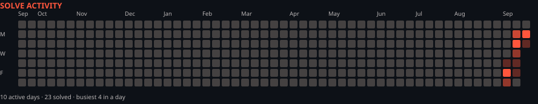

<h1>LeetCode Solutions</h1>

<em>Automatically synced with every accepted submission</em>

   

<picture>
  <source media="(prefers-color-scheme: dark)" srcset=".leetsync/stats-dark.svg">
  <source media="(prefers-color-scheme: light)" srcset=".leetsync/stats-light.svg">
  
</picture>

<picture>
  <source media="(prefers-color-scheme: dark)" srcset=".leetsync/calendar-dark.svg">
  <source media="(prefers-color-scheme: light)" srcset=".leetsync/calendar-light.svg">
  
</picture>

---

### ALL SOLUTIONS

| # | Problem | Difficulty | Language | Date |
|:---:|:--------|:----------:|:--------:|:----:|
| 2 | [Add Two Numbers](problems/0002-Add-Two-Numbers) | 🟧 Medium | `Java` | 2026-09-21 |
| 19 | [Remove Nth Node From End of List](problems/0019-Remove-Nth-Node-From-End-of-List) | 🟧 Medium | `Java` | 2026-09-14 |
| 24 | [Swap Nodes in Pairs](problems/0024-Swap-Nodes-in-Pairs) | 🟧 Medium | `Java` | 2026-09-12 |
| 25 | [Reverse Nodes in k-Group](problems/0025-Reverse-Nodes-in-k-Group) | 🟥 Hard | `Java` | 2026-09-12 |
| 61 | [Rotate List](problems/0061-Rotate-List) | 🟧 Medium | `Java` | 2026-09-21 |
| 86 | [Partition List](problems/0086-Partition-List) | 🟧 Medium | `Java` | 2026-09-14 |
| 92 | [Reverse Linked List II](problems/0092-Reverse-Linked-List-II) | 🟧 Medium | `Java` | 2026-09-11 |
| 142 | [Linked List Cycle II](problems/0142-Linked-List-Cycle-II) | 🟧 Medium | `Java` | 2026-09-10 |
| 143 | [Reorder List](problems/0143-Reorder-List) | 🟧 Medium | `Java` | 2026-09-17 |
| 148 | [Sort List](problems/0148-Sort-List) | 🟧 Medium | `Java` | 2026-09-15 |
| 160 | [Intersection of Two Linked Lists](problems/0160-Intersection-of-Two-Linked-Lists) | 🟩 Easy | `Java` | 2026-09-16 |
| 167 | [Two Sum II - Input Array Is Sorted](problems/0167-Two-Sum-II---Input-Array-Is-Sorted) | 🟧 Medium | `Java` | 2026-09-11 |
| 189 | [Rotate Array](problems/0189-Rotate-Array) | 🟧 Medium | `Java` | 2026-09-18 |
| 234 | [Palindrome Linked List](problems/0234-Palindrome-Linked-List) | 🟩 Easy | `Java` | 2026-09-11 |
| 283 | [Move Zeroes](problems/0283-Move-Zeroes) | 🟩 Easy | `Java` | 2026-09-11 |
| 328 | [Odd Even Linked List](problems/0328-Odd-Even-Linked-List) | 🟧 Medium | `Java` | 2026-09-15 |
| 445 | [Add Two Numbers II](problems/0445-Add-Two-Numbers-II) | 🟧 Medium | `Java` | 2026-09-21 |
| 904 | [Fruit Into Baskets](problems/0904-Fruit-Into-Baskets) | 🟧 Medium | `Java` | 2026-09-21 |
| 912 | [Sort an Array](problems/0912-Sort-an-Array) | 🟧 Medium | `Java` | 2026-09-15 |
| 1004 | [Max Consecutive Ones III](problems/1004-Max-Consecutive-Ones-III) | 🟧 Medium | `Java` | 2026-09-16 |
| 1669 | [Merge In Between Linked Lists](problems/1669-Merge-In-Between-Linked-Lists) | 🟧 Medium | `Java` | 2026-09-15 |
| 2095 | [Delete the Middle Node of a Linked List](problems/2095-Delete-the-Middle-Node-of-a-Linked-List) | 🟧 Medium | `Java` | 2026-09-14 |

---

Auto-synced by <strong>LeetSync</strong> · Built by <a href="https://deveshsamant.in/">Devesh Samant</a>

