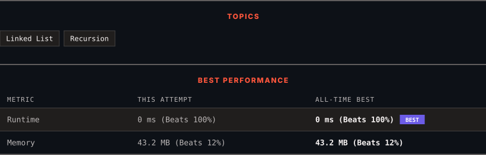

# 24. Swap Nodes in Pairs

      

---

<picture>
  <source media="(prefers-color-scheme: dark)" srcset="panel-dark.svg">
  <source media="(prefers-color-scheme: light)" srcset="panel-light.svg">
  
</picture>

> **New personal best** — Runtime improved on this submission.

### HOW IT WENT

| | |
|:--|:--|
| **Attempts** | first try |
| **Time to solve** | under a minute |
| **Verdicts** | ✅ Accepted |

---

### NOTES

_No notes yet._

---

### SOLUTIONS (1)

| # | File | Language | Date |
|:-:|------|:--------:|:----:|
| 1 | [sol1.java](./sol1.java) | `Java` | 2026-09-12 ← **latest** |

---

### PROBLEM DESCRIPTION

Given a linked list, swap every two adjacent nodes and return its head. You must solve the problem without modifying the values in the list's nodes (i.e., only nodes themselves may be changed.)

 

**Example 1:**

**Input:** head = [1,2,3,4]

**Output:** [2,1,4,3]

**Explanation:**

**Example 2:**

**Input:** head = []

**Output:** []

**Example 3:**

**Input:** head = [1]

**Output:** [1]

**Example 4:**

**Input:** head = [1,2,3]

**Output:** [2,1,3]

 

**Constraints:**

	- The number of nodes in the list is in the range `[0, 100]`.

	- `0 <= Node.val <= 100`

---

Auto-synced by <strong>LeetSync</strong> · Built by <a href="https://deveshsamant.in/">Devesh Samant</a>

