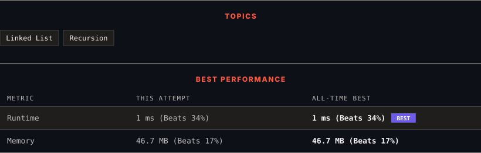

<div align="center">

# 25. Reverse Nodes in k-Group

      

[](https://leetcode.com/problems/reverse-nodes-in-k-group/)

</div>

---

<div align="center">

<picture>
  <source media="(prefers-color-scheme: dark)" srcset="panel-dark.svg">
  <source media="(prefers-color-scheme: light)" srcset="panel-light.svg">
  
</picture>

</div>

> **New personal best** — Runtime improved on this submission.

### HOW IT WENT

| | |
|:--|:--|
| **Attempts** | first try |
| **Time to solve** | under a minute |
| **Verdicts** | ✅ Accepted |

---

### NOTES

_No notes yet._

---

### SOLUTIONS (1)

| # | File | Language | Date |
|:-:|------|:--------:|:----:|
| 1 | [sol1.java](./sol1.java) | `Java` | 2026-09-12 ← **latest** |

---

### PROBLEM DESCRIPTION

Given the `head` of a linked list, reverse the nodes of the list `k` at a time, and return *the modified list*.

`k` is a positive integer and is less than or equal to the length of the linked list. If the number of nodes is not a multiple of `k` then left-out nodes, in the end, should remain as it is.

You may not alter the values in the list's nodes, only nodes themselves may be changed.

 

**Example 1:**


```

**Input:** head = [1,2,3,4,5], k = 2
**Output:** [2,1,4,3,5]

```

**Example 2:**


```

**Input:** head = [1,2,3,4,5], k = 3
**Output:** [3,2,1,4,5]

```

 

**Constraints:**

	- The number of nodes in the list is `n`.

	- `1 <= k <= n <= 5000`

	- `0 <= Node.val <= 1000`

 

**Follow-up:** Can you solve the problem in `O(1)` extra memory space?

---

<div align="center">

<sub>Auto-synced by <strong>LeetSync</strong> · Built by <a href="https://deveshsamant.in/">Devesh Samant</a></sub>

</div>
