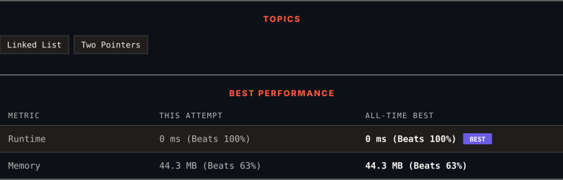

<div align="center">

# 61. Rotate List

      

[](https://leetcode.com/problems/rotate-list/)

</div>

---

<div align="center">

<picture>
  <source media="(prefers-color-scheme: dark)" srcset="panel-dark.svg">
  <source media="(prefers-color-scheme: light)" srcset="panel-light.svg">
  
</picture>

</div>

> **New personal best** — Runtime improved on this submission.

### HOW IT WENT

| | |
|:--|:--|
| **Attempts** | 4 before accepted |
| **Time to solve** | 2 h 9 min |
| **Verdicts** | 💥 Runtime Error → 💥 Runtime Error → 💥 Runtime Error → ✅ Accepted |

---

### NOTES

_No notes yet._

---

### SOLUTIONS (1)

| # | File | Language | Date |
|:-:|------|:--------:|:----:|
| 1 | [sol1.java](./sol1.java) | `Java` | 2026-09-21 ← **latest** |

---

### PROBLEM DESCRIPTION

Given the `head` of a linked list, rotate the list to the right by `k` places.

 

**Example 1:**


```

**Input:** head = [1,2,3,4,5], k = 2
**Output:** [4,5,1,2,3]

```

**Example 2:**


```

**Input:** head = [0,1,2], k = 4
**Output:** [2,0,1]

```

 

**Constraints:**

	- The number of nodes in the list is in the range `[0, 500]`.

	- `-100 <= Node.val <= 100`

	- `0 <= k <= 2 * 10^9`

---

<div align="center">

<sub>Auto-synced by <strong>LeetSync</strong> · Built by <a href="https://deveshsamant.in/">Devesh Samant</a></sub>

</div>
