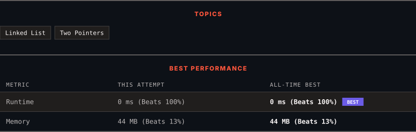

<div align="center">

# 86. Partition List

      

[](https://leetcode.com/problems/partition-list/)

</div>

---

<div align="center">

<picture>
  <source media="(prefers-color-scheme: dark)" srcset="panel-dark.svg">
  <source media="(prefers-color-scheme: light)" srcset="panel-light.svg">
  
</picture>

</div>

> **New personal best** — Runtime improved on this submission.

### HOW IT WENT

| | |
|:--|:--|
| **Attempts** | first try |
| **Time to solve** | under a minute |
| **Verdicts** | ✅ Accepted |

---

### NOTES

_No notes yet._

---

### SOLUTIONS (1)

| # | File | Language | Date |
|:-:|------|:--------:|:----:|
| 1 | [sol1.java](./sol1.java) | `Java` | 2026-09-14 ← **latest** |

---

### PROBLEM DESCRIPTION

Given the `head` of a linked list and a value `x`, partition it such that all nodes **less than** `x` come before nodes **greater than or equal** to `x`.

You should **preserve** the original relative order of the nodes in each of the two partitions.

 

**Example 1:**


```

**Input:** head = [1,4,3,2,5,2], x = 3
**Output:** [1,2,2,4,3,5]

```

**Example 2:**

```

**Input:** head = [2,1], x = 2
**Output:** [1,2]

```

 

**Constraints:**

	- The number of nodes in the list is in the range `[0, 200]`.

	- `-100 <= Node.val <= 100`

	- `-200 <= x <= 200`

---

<div align="center">

<sub>Auto-synced by <strong>LeetSync</strong> · Built by <a href="https://deveshsamant.in/">Devesh Samant</a></sub>

</div>
