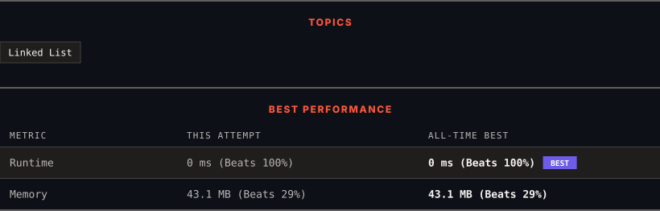

<div align="center">

# 92. Reverse Linked List II

      

[](https://leetcode.com/problems/reverse-linked-list-ii/)

</div>

---

<div align="center">

<picture>
  <source media="(prefers-color-scheme: dark)" srcset="panel-dark.svg">
  <source media="(prefers-color-scheme: light)" srcset="panel-light.svg">
  
</picture>

</div>

> **New personal best** — Runtime improved on this submission.

### HOW IT WENT

| | |
|:--|:--|
| **Attempts** | 2 before accepted |
| **Time to solve** | 31 min |
| **Verdicts** | ❌ Wrong Answer → ✅ Accepted |

---

### NOTES

_No notes yet._

---

### SOLUTIONS (1)

| # | File | Language | Date |
|:-:|------|:--------:|:----:|
| 1 | [sol1.java](./sol1.java) | `Java` | 2026-09-11 ← **latest** |

---

### PROBLEM DESCRIPTION

Given the `head` of a singly linked list and two integers `left` and `right` where `left <= right`, reverse the nodes of the list from position `left` to position `right`, and return *the reversed list*.

 

**Example 1:**


```

**Input:** head = [1,2,3,4,5], left = 2, right = 4
**Output:** [1,4,3,2,5]

```

**Example 2:**

```

**Input:** head = [5], left = 1, right = 1
**Output:** [5]

```

 

**Constraints:**

	- The number of nodes in the list is `n`.

	- `1 <= n <= 500`

	- `-500 <= Node.val <= 500`

	- `1 <= left <= right <= n`

 

**Follow up:** Could you do it in one pass?

---

<div align="center">

<sub>Auto-synced by <strong>LeetSync</strong> · Built by <a href="https://deveshsamant.in/">Devesh Samant</a></sub>

</div>
