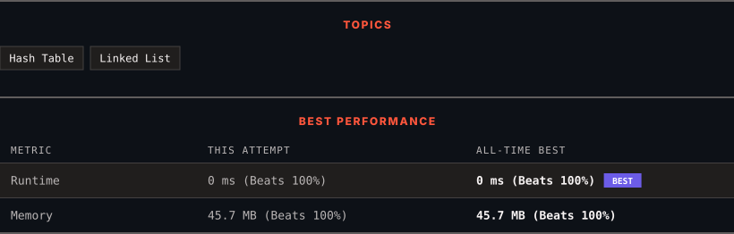

<div align="center">

# 138. Copy List with Random Pointer

      

[](https://leetcode.com/problems/copy-list-with-random-pointer/)

</div>

---

<div align="center">

<picture>
  <source media="(prefers-color-scheme: dark)" srcset="panel-dark.svg">
  <source media="(prefers-color-scheme: light)" srcset="panel-light.svg">
  
</picture>

</div>

> **New personal best** — Runtime improved on this submission.

### HOW IT WENT

| | |
|:--|:--|
| **Attempts** | first try |
| **Time to solve** | 1 h 44 min |
| **Verdicts** | ✅ Accepted |

---

### NOTES

_No notes yet._

---

### SOLUTIONS (1)

| # | File | Language | Date |
|:-:|------|:--------:|:----:|
| 1 | [sol1.java](./sol1.java) | `Java` | 2026-09-22 ← **latest** |

---

### PROBLEM DESCRIPTION

A linked list of length `n` is given such that each node contains an additional random pointer, which could point to any node in the list, or `null`.

Construct a [**deep copy**](https://en.wikipedia.org/wiki/Object_copying#Deep_copy) of the list. The deep copy should consist of exactly `n` **brand new** nodes, where each new node has its value set to the value of its corresponding original node. Both the `next` and `random` pointer of the new nodes should point to new nodes in the copied list such that the pointers in the original list and copied list represent the same list state. **None of the pointers in the new list should point to nodes in the original list**.

For example, if there are two nodes `X` and `Y` in the original list, where `X.random --> Y`, then for the corresponding two nodes `x` and `y` in the copied list, `x.random --> y`.

Return *the head of the copied linked list*.

The linked list is represented in the input/output as a list of `n` nodes. Each node is represented as a pair of `[val, random_index]` where:

	- `val`: an integer representing `Node.val`

	- `random_index`: the index of the node (range from `0` to `n-1`) that the `random` pointer points to, or `null` if it does not point to any node.

Your code will **only** be given the `head` of the original linked list.

 

**Example 1:**


```

**Input:** head = [[7,null],[13,0],[11,4],[10,2],[1,0]]
**Output:** [[7,null],[13,0],[11,4],[10,2],[1,0]]

```

**Example 2:**


```

**Input:** head = [[1,1],[2,1]]
**Output:** [[1,1],[2,1]]

```

**Example 3:**

****

```

**Input:** head = [[3,null],[3,0],[3,null]]
**Output:** [[3,null],[3,0],[3,null]]

```

 

**Constraints:**

	- `0 <= n <= 1000`

	- `-10^4 <= Node.val <= 10^4`

	- `Node.random` is `null` or is pointing to some node in the linked list.

---

<div align="center">

<sub>Auto-synced by <strong>LeetSync</strong> · Built by <a href="https://deveshsamant.in/">Devesh Samant</a></sub>

</div>
