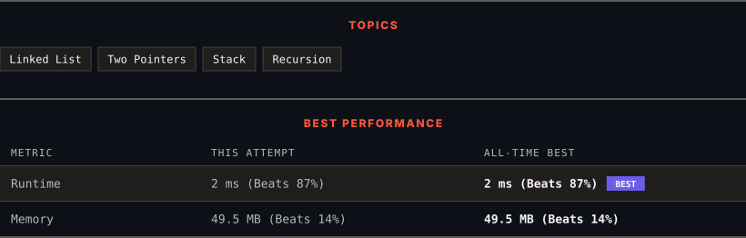

<div align="center">

# 143. Reorder List

      

[](https://leetcode.com/problems/reorder-list/)

</div>

---

<div align="center">

<picture>
  <source media="(prefers-color-scheme: dark)" srcset="panel-dark.svg">
  <source media="(prefers-color-scheme: light)" srcset="panel-light.svg">
  
</picture>

</div>

### HOW IT WENT

| | |
|:--|:--|
| **Attempts** | 2 before accepted |
| **Time to solve** | 36 h 3 min |
| **Verdicts** | ✅ Accepted → ✅ Accepted |

---

### NOTES

_No notes yet._

---

### SOLUTIONS (2)

| # | File | Language | Date |
|:-:|------|:--------:|:----:|
| 1 | [sol1.java](./sol1.java) | `Java` | 2026-09-17 |
| 2 | [sol2.java](./sol2.java) | `Java` | 2026-09-17 ← **latest** |

---

### PROBLEM DESCRIPTION

You are given the head of a singly linked-list. The list can be represented as:

```

L_0 &rarr; L_1 &rarr; &hellip; &rarr; L_n - 1 &rarr; L_n

```

*Reorder the list to be on the following form:*

```

L_0 &rarr; L_n &rarr; L_1 &rarr; L_n - 1 &rarr; L_2 &rarr; L_n - 2 &rarr; &hellip;

```

You may not modify the values in the list's nodes. Only nodes themselves may be changed.

 

**Example 1:**


```

**Input:** head = [1,2,3,4]
**Output:** [1,4,2,3]

```

**Example 2:**


```

**Input:** head = [1,2,3,4,5]
**Output:** [1,5,2,4,3]

```

 

**Constraints:**

	- The number of nodes in the list is in the range `[1, 5 * 10^4]`.

	- `1 <= Node.val <= 1000`

---

<div align="center">

<sub>Auto-synced by <strong>LeetSync</strong> · Built by <a href="https://deveshsamant.in/">Devesh Samant</a></sub>

</div>
