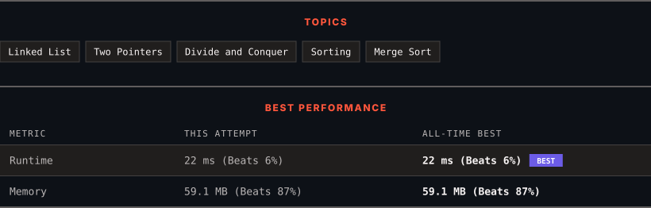

<div align="center">

# 148. Sort List

      

[](https://leetcode.com/problems/sort-list/)

</div>

---

<div align="center">

<picture>
  <source media="(prefers-color-scheme: dark)" srcset="panel-dark.svg">
  <source media="(prefers-color-scheme: light)" srcset="panel-light.svg">
  
</picture>

</div>

> **New personal best** — Runtime improved on this submission.

### HOW IT WENT

| | |
|:--|:--|
| **Attempts** | first try |
| **Time to solve** | 3 h 1 min |
| **Verdicts** | ✅ Accepted |

---

### NOTES

_No notes yet._

---

### SOLUTIONS (1)

| # | File | Language | Date |
|:-:|------|:--------:|:----:|
| 1 | [sol1.java](./sol1.java) | `Java` | 2026-09-15 ← **latest** |

---

### PROBLEM DESCRIPTION

Given the `head` of a linked list, return *the list after sorting it in **ascending order***.

 

**Example 1:**


```

**Input:** head = [4,2,1,3]
**Output:** [1,2,3,4]

```

**Example 2:**


```

**Input:** head = [-1,5,3,4,0]
**Output:** [-1,0,3,4,5]

```

**Example 3:**

```

**Input:** head = []
**Output:** []

```

 

**Constraints:**

	- The number of nodes in the list is in the range `[0, 5 * 10^4]`.

	- `-10^5 <= Node.val <= 10^5`

 

**Follow up:** Can you sort the linked list in `O(n logn)` time and `O(1)` memory (i.e. constant space)?

---

<div align="center">

<sub>Auto-synced by <strong>LeetSync</strong> · Built by <a href="https://deveshsamant.in/">Devesh Samant</a></sub>

</div>
