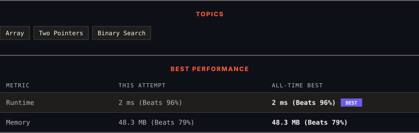

<div align="center">

# 167. Two Sum II - Input Array Is Sorted

      

[](https://leetcode.com/problems/two-sum-ii-input-array-is-sorted/)

</div>

---

<div align="center">

<picture>
  <source media="(prefers-color-scheme: dark)" srcset="panel-dark.svg">
  <source media="(prefers-color-scheme: light)" srcset="panel-light.svg">
  
</picture>

</div>

> **New personal best** — Runtime improved on this submission.

### HOW IT WENT

| | |
|:--|:--|
| **Attempts** | first try |
| **Time to solve** | 5 min |
| **Verdicts** | ✅ Accepted |

---

### NOTES

_No notes yet._

---

### SOLUTIONS (1)

| # | File | Language | Date |
|:-:|------|:--------:|:----:|
| 1 | [sol1.java](./sol1.java) | `Java` | 2026-09-11 ← **latest** |

---

### PROBLEM DESCRIPTION

Given a **1-indexed** array of integers `numbers` that is already ***sorted in non-decreasing order***, find two numbers such that they add up to a specific `target` number. Let these two numbers be `numbers[index_1]` and `numbers[index_2]` where `1 <= index_1 < index_2 <= numbers.length`.

Return* the indices of the two numbers *`index_1`* and *`index_2`*, **each incremented by one,** as an integer array *`[index_1, index_2]`* of length 2.*

The tests are generated such that there is **exactly one solution**. You **may not** use the same element twice.

Your solution must use only constant extra space.

 

**Example 1:**

```

**Input:** numbers = [2,7,11,15], target = 9
**Output:** [1,2]
**Explanation:** The sum of 2 and 7 is 9. Therefore, index_1 = 1, index_2 = 2. We return [1, 2].

```

**Example 2:**

```

**Input:** numbers = [2,3,4], target = 6
**Output:** [1,3]
**Explanation:** The sum of 2 and 4 is 6. Therefore index_1 = 1, index_2 = 3. We return [1, 3].

```

**Example 3:**

```

**Input:** numbers = [-1,0], target = -1
**Output:** [1,2]
**Explanation:** The sum of -1 and 0 is -1. Therefore index_1 = 1, index_2 = 2. We return [1, 2].

```

 

**Constraints:**

	- `2 <= numbers.length <= 3 * 10^4`

	- `-1000 <= numbers[i] <= 1000`

	- `numbers` is sorted in **non-decreasing order**.

	- `-1000 <= target <= 1000`

	- The tests are generated such that there is **exactly one solution**.

---

<div align="center">

<sub>Auto-synced by <strong>LeetSync</strong> · Built by <a href="https://deveshsamant.in/">Devesh Samant</a></sub>

</div>
