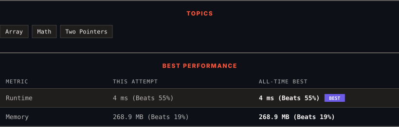

<div align="center">

# 189. Rotate Array

      

[](https://leetcode.com/problems/rotate-array/)

</div>

---

<div align="center">

<picture>
  <source media="(prefers-color-scheme: dark)" srcset="panel-dark.svg">
  <source media="(prefers-color-scheme: light)" srcset="panel-light.svg">
  
</picture>

</div>

> **New personal best** — Runtime improved on this submission.

### HOW IT WENT

| | |
|:--|:--|
| **Attempts** | 3 before accepted |
| **Time to solve** | 8 min |
| **Verdicts** | ⏱ Time Limit Exceeded → ❌ Wrong Answer → ✅ Accepted |

---

### NOTES

_No notes yet._

---

### SOLUTIONS (1)

| # | File | Language | Date |
|:-:|------|:--------:|:----:|
| 1 | [sol1.java](./sol1.java) | `Java` | 2026-09-18 ← **latest** |

---

### PROBLEM DESCRIPTION

Given an integer array `nums`, rotate the array to the right by `k` steps, where `k` is non-negative.

 

**Example 1:**

```

**Input:** nums = [1,2,3,4,5,6,7], k = 3
**Output:** [5,6,7,1,2,3,4]
**Explanation:**
rotate 1 steps to the right: [7,1,2,3,4,5,6]
rotate 2 steps to the right: [6,7,1,2,3,4,5]
rotate 3 steps to the right: [5,6,7,1,2,3,4]

```

**Example 2:**

```

**Input:** nums = [-1,-100,3,99], k = 2
**Output:** [3,99,-1,-100]
**Explanation:** 
rotate 1 steps to the right: [99,-1,-100,3]
rotate 2 steps to the right: [3,99,-1,-100]

```

 

**Constraints:**

	- `1 <= nums.length <= 10^5`

	- `-2^31 <= nums[i] <= 2^31 - 1`

	- `0 <= k <= 10^5`

 

**Follow up:**

	- Try to come up with as many solutions as you can. There are at least **three** different ways to solve this problem.

	- Could you do it in-place with `O(1)` extra space?

---

<div align="center">

<sub>Auto-synced by <strong>LeetSync</strong> · Built by <a href="https://deveshsamant.in/">Devesh Samant</a></sub>

</div>
