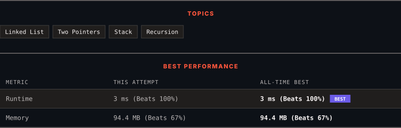

<div align="center">

# 234. Palindrome Linked List

      

[](https://leetcode.com/problems/palindrome-linked-list/)

</div>

---

<div align="center">

<picture>
  <source media="(prefers-color-scheme: dark)" srcset="panel-dark.svg">
  <source media="(prefers-color-scheme: light)" srcset="panel-light.svg">
  
</picture>

</div>

> **New personal best** — Runtime improved on this submission.

### HOW IT WENT

| | |
|:--|:--|
| **Attempts** | 3 before accepted |
| **Time to solve** | 18 h 34 min |
| **Verdicts** | ❌ Wrong Answer → ❌ Wrong Answer → ✅ Accepted |

---

### NOTES

_No notes yet._

---

### SOLUTIONS (1)

| # | File | Language | Date |
|:-:|------|:--------:|:----:|
| 1 | [sol1.java](./sol1.java) | `Java` | 2026-09-11 ← **latest** |

---

### PROBLEM DESCRIPTION

Given the `head` of a singly linked list, return `true`* if it is a **palindrome** or *`false`* otherwise*.

 

**Example 1:**


```

**Input:** head = [1,2,2,1]
**Output:** true

```

**Example 2:**


```

**Input:** head = [1,2]
**Output:** false

```

 

**Constraints:**

	- The number of nodes in the list is in the range `[1, 10^5]`.

	- `0 <= Node.val <= 9`

 

**Follow up:** Could you do it in `O(n)` time and `O(1)` space?

---

<div align="center">

<sub>Auto-synced by <strong>LeetSync</strong> · Built by <a href="https://deveshsamant.in/">Devesh Samant</a></sub>

</div>
