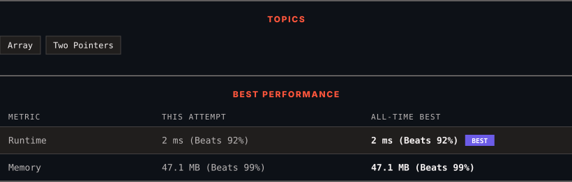

<div align="center">

# 283. Move Zeroes

      

[](https://leetcode.com/problems/move-zeroes/)

</div>

---

<div align="center">

<picture>
  <source media="(prefers-color-scheme: dark)" srcset="panel-dark.svg">
  <source media="(prefers-color-scheme: light)" srcset="panel-light.svg">
  
</picture>

</div>

> **New personal best** — Runtime improved on this submission.

### HOW IT WENT

| | |
|:--|:--|
| **Attempts** | 2 before accepted |
| **Time to solve** | under a minute |
| **Verdicts** | ✅ Accepted → ✅ Accepted |

---

### NOTES

_No notes yet._

---

### SOLUTIONS (2)

| # | File | Language | Date |
|:-:|------|:--------:|:----:|
| 1 | [sol1.java](./sol1.java) | `Java` | 2026-09-11 |
| 2 | [sol2.java](./sol2.java) | `Java` | 2026-09-11 ← **latest** |

---

### PROBLEM DESCRIPTION

Given an integer array `nums`, move all `0`'s to the end of it while maintaining the relative order of the non-zero elements.

**Note** that you must do this in-place without making a copy of the array.

 

**Example 1:**

```
**Input:** nums = [0,1,0,3,12]
**Output:** [1,3,12,0,0]

```

**Example 2:**

```
**Input:** nums = [0]
**Output:** [0]

```

 

**Constraints:**

	- `1 <= nums.length <= 10^4`

	- `-2^31 <= nums[i] <= 2^31 - 1`

 

**Follow up:** Could you minimize the total number of operations done?

---

<div align="center">

<sub>Auto-synced by <strong>LeetSync</strong> · Built by <a href="https://deveshsamant.in/">Devesh Samant</a></sub>

</div>
