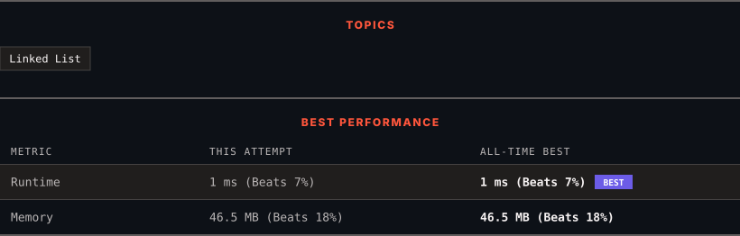

<div align="center">

# 328. Odd Even Linked List

      

[](https://leetcode.com/problems/odd-even-linked-list/)

</div>

---

<div align="center">

<picture>
  <source media="(prefers-color-scheme: dark)" srcset="panel-dark.svg">
  <source media="(prefers-color-scheme: light)" srcset="panel-light.svg">
  
</picture>

</div>

> **New personal best** — Runtime improved on this submission.

### HOW IT WENT

| | |
|:--|:--|
| **Attempts** | first try |
| **Time to solve** | 4 min |
| **Verdicts** | ✅ Accepted |

---

### NOTES

_No notes yet._

---

### SOLUTIONS (1)

| # | File | Language | Date |
|:-:|------|:--------:|:----:|
| 1 | [sol1.java](./sol1.java) | `Java` | 2026-09-15 ← **latest** |

---

### PROBLEM DESCRIPTION

Given the `head` of a singly linked list, group all the nodes with odd indices together followed by the nodes with even indices, and return *the reordered list*.

The **first** node is considered **odd**, and the **second** node is **even**, and so on.

Note that the relative order inside both the even and odd groups should remain as it was in the input.

You must solve the problem in `O(1)` extra space complexity and `O(n)` time complexity.

 

**Example 1:**


```

**Input:** head = [1,2,3,4,5]
**Output:** [1,3,5,2,4]

```

**Example 2:**


```

**Input:** head = [2,1,3,5,6,4,7]
**Output:** [2,3,6,7,1,5,4]

```

 

**Constraints:**

	- The number of nodes in the linked list is in the range `[0, 10^4]`.

	- `-10^6 <= Node.val <= 10^6`

---

<div align="center">

<sub>Auto-synced by <strong>LeetSync</strong> · Built by <a href="https://deveshsamant.in/">Devesh Samant</a></sub>

</div>
