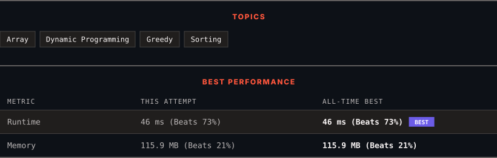

<div align="center">

# 435. Non-overlapping Intervals

      

[](https://leetcode.com/problems/non-overlapping-intervals/)

</div>

---

<div align="center">

<picture>
  <source media="(prefers-color-scheme: dark)" srcset="panel-dark.svg">
  <source media="(prefers-color-scheme: light)" srcset="panel-light.svg">
  
</picture>

</div>

> **New personal best** — Runtime improved on this submission.

### HOW IT WENT

| | |
|:--|:--|
| **Attempts** | first try |
| **Time to solve** | 50 min |
| **Verdicts** | ✅ Accepted |

---

### NOTES

_No notes yet._

---

### SOLUTIONS (1)

| # | File | Language | Date |
|:-:|------|:--------:|:----:|
| 1 | [sol1.java](./sol1.java) | `Java` | 2026-10-07 ← **latest** |

---

### PROBLEM DESCRIPTION

Given an array of intervals `intervals` where `intervals[i] = [start_i, end_i]`, return *the minimum number of intervals you need to remove to make the rest of the intervals non-overlapping*.

**Note** that intervals which only touch at a point are **non-overlapping**. For example, `[1, 2]` and `[2, 3]` are non-overlapping.

 

**Example 1:**

```

**Input:** intervals = [[1,2],[2,3],[3,4],[1,3]]
**Output:** 1
**Explanation:** [1,3] can be removed and the rest of the intervals are non-overlapping.

```

**Example 2:**

```

**Input:** intervals = [[1,2],[1,2],[1,2]]
**Output:** 2
**Explanation:** You need to remove two [1,2] to make the rest of the intervals non-overlapping.

```

**Example 3:**

```

**Input:** intervals = [[1,2],[2,3]]
**Output:** 0
**Explanation:** You don't need to remove any of the intervals since they're already non-overlapping.

```

 

**Constraints:**

	- `1 <= intervals.length <= 10^5`

	- `intervals[i].length == 2`

	- `-5 * 10^4 <= start_i < end_i <= 5 * 10^4`

---

<div align="center">

<sub>Auto-synced by <strong>LeetSync</strong> · Built by <a href="https://deveshsamant.in/">Devesh Samant</a></sub>

</div>
