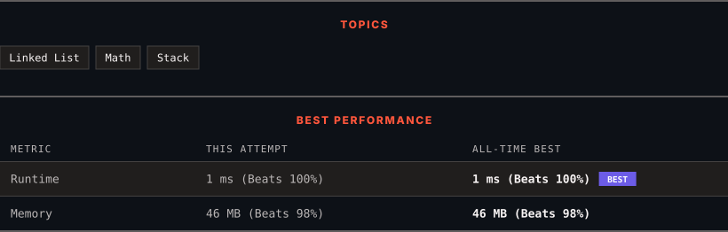

<div align="center">

# 445. Add Two Numbers II

      

[](https://leetcode.com/problems/add-two-numbers-ii/)

</div>

---

<div align="center">

<picture>
  <source media="(prefers-color-scheme: dark)" srcset="panel-dark.svg">
  <source media="(prefers-color-scheme: light)" srcset="panel-light.svg">
  
</picture>

</div>

> **New personal best** — Runtime improved on this submission.

### HOW IT WENT

| | |
|:--|:--|
| **Attempts** | first try |
| **Time to solve** | under a minute |
| **Verdicts** | ✅ Accepted |

---

### NOTES

_No notes yet._

---

### SOLUTIONS (1)

| # | File | Language | Date |
|:-:|------|:--------:|:----:|
| 1 | [sol1.java](./sol1.java) | `Java` | 2026-09-21 ← **latest** |

---

### PROBLEM DESCRIPTION

You are given two **non-empty** linked lists representing two non-negative integers. The most significant digit comes first and each of their nodes contains a single digit. Add the two numbers and return the sum as a linked list.

You may assume the two numbers do not contain any leading zero, except the number 0 itself.

 

**Example 1:**


```

**Input:** l1 = [7,2,4,3], l2 = [5,6,4]
**Output:** [7,8,0,7]

```

**Example 2:**

```

**Input:** l1 = [2,4,3], l2 = [5,6,4]
**Output:** [8,0,7]

```

**Example 3:**

```

**Input:** l1 = [0], l2 = [0]
**Output:** [0]

```

 

**Constraints:**

	- The number of nodes in each linked list is in the range `[1, 100]`.

	- `0 <= Node.val <= 9`

	- It is guaranteed that the list represents a number that does not have leading zeros.

 

**Follow up:** Could you solve it without reversing the input lists?

---

<div align="center">

<sub>Auto-synced by <strong>LeetSync</strong> · Built by <a href="https://deveshsamant.in/">Devesh Samant</a></sub>

</div>
