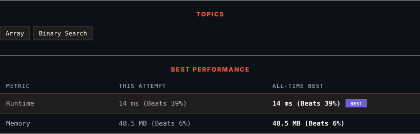

<div align="center">

# 875. Koko Eating Bananas

      

[](https://leetcode.com/problems/koko-eating-bananas/)

</div>

---

<div align="center">

<picture>
  <source media="(prefers-color-scheme: dark)" srcset="panel-dark.svg">
  <source media="(prefers-color-scheme: light)" srcset="panel-light.svg">
  
</picture>

</div>

> **New personal best** — Runtime improved on this submission.

### HOW IT WENT

| | |
|:--|:--|
| **Attempts** | 5 before accepted |
| **Time to solve** | 1 h 30 min |
| **Verdicts** | ❌ Wrong Answer → ❌ Wrong Answer → ❌ Wrong Answer → ✅ Accepted → ✅ Accepted |

---

### NOTES

_No notes yet._

---

### SOLUTIONS (2)

| # | File | Language | Date |
|:-:|------|:--------:|:----:|
| 1 | [sol1.java](./sol1.java) | `Java` | 2026-09-23 |
| 2 | [sol2.java](./sol2.java) | `Java` | 2026-09-23 ← **latest** |

---

### PROBLEM DESCRIPTION

Koko loves to eat bananas. There are `n` piles of bananas, the `i^th` pile has `piles[i]` bananas. The guards have gone and will come back in `h` hours.

Koko can decide her bananas-per-hour eating speed of `k`. Each hour, she chooses some pile of bananas and eats `k` bananas from that pile. If the pile has less than `k` bananas, she eats all of them instead and will not eat any more bananas during this hour.

Koko likes to eat slowly but still wants to finish eating all the bananas before the guards return.

Return *the minimum integer* `k` *such that she can eat all the bananas within* `h` *hours*.

 

**Example 1:**

```

**Input:** piles = [3,6,7,11], h = 8
**Output:** 4

```

**Example 2:**

```

**Input:** piles = [30,11,23,4,20], h = 5
**Output:** 30

```

**Example 3:**

```

**Input:** piles = [30,11,23,4,20], h = 6
**Output:** 23

```

 

**Constraints:**

	- `1 <= piles.length <= 10^4`

	- `piles.length <= h <= 10^9`

	- `1 <= piles[i] <= 10^9`

---

<div align="center">

<sub>Auto-synced by <strong>LeetSync</strong> · Built by <a href="https://deveshsamant.in/">Devesh Samant</a></sub>

</div>
