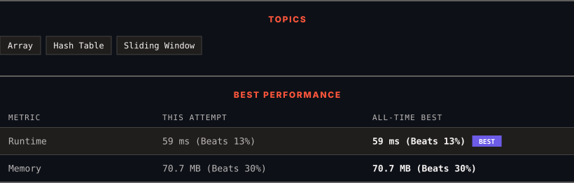

<div align="center">

# 904. Fruit Into Baskets

      

[](https://leetcode.com/problems/fruit-into-baskets/)

</div>

---

<div align="center">

<picture>
  <source media="(prefers-color-scheme: dark)" srcset="panel-dark.svg">
  <source media="(prefers-color-scheme: light)" srcset="panel-light.svg">
  
</picture>

</div>

> **New personal best** — Runtime improved on this submission.

### HOW IT WENT

| | |
|:--|:--|
| **Attempts** | 2 before accepted |
| **Time to solve** | 124 h 14 min |
| **Verdicts** | ❌ Wrong Answer → ✅ Accepted |

---

### NOTES

_No notes yet._

---

### SOLUTIONS (1)

| # | File | Language | Date |
|:-:|------|:--------:|:----:|
| 1 | [sol1.java](./sol1.java) | `Java` | 2026-09-21 ← **latest** |

---

### PROBLEM DESCRIPTION

You are visiting a farm that has a single row of fruit trees arranged from left to right. The trees are represented by an integer array `fruits` where `fruits[i]` is the **type** of fruit the `i^th` tree produces.

You want to collect as much fruit as possible. However, the owner has some strict rules that you must follow:

	- You only have **two** baskets, and each basket can only hold a **single type** of fruit. There is no limit on the amount of fruit each basket can hold.

	- Starting from any tree of your choice, you must pick **exactly one fruit** from **every** tree (including the start tree) while moving to the right. The picked fruits must fit in one of your baskets.

	- Once you reach a tree with fruit that cannot fit in your baskets, you must stop.

Given the integer array `fruits`, return *the **maximum** number of fruits you can pick*.

 

**Example 1:**

```

**Input:** fruits = [1,2,1]
**Output:** 3
**Explanation:** We can pick from all 3 trees.

```

**Example 2:**

```

**Input:** fruits = [0,1,2,2]
**Output:** 3
**Explanation:** We can pick from trees [1,2,2].
If we had started at the first tree, we would only pick from trees [0,1].

```

**Example 3:**

```

**Input:** fruits = [1,2,3,2,2]
**Output:** 4
**Explanation:** We can pick from trees [2,3,2,2].
If we had started at the first tree, we would only pick from trees [1,2].

```

 

**Constraints:**

	- `1 <= fruits.length <= 10^5`

	- `0 <= fruits[i] < fruits.length`

---

<div align="center">

<sub>Auto-synced by <strong>LeetSync</strong> · Built by <a href="https://deveshsamant.in/">Devesh Samant</a></sub>

</div>
