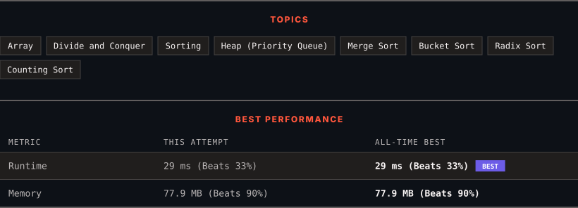

<div align="center">

# 912. Sort an Array

      

[](https://leetcode.com/problems/sort-an-array/)

</div>

---

<div align="center">

<picture>
  <source media="(prefers-color-scheme: dark)" srcset="panel-dark.svg">
  <source media="(prefers-color-scheme: light)" srcset="panel-light.svg">
  
</picture>

</div>

> **New personal best** — Runtime improved on this submission.

### HOW IT WENT

| | |
|:--|:--|
| **Attempts** | first try |
| **Time to solve** | 11 min |
| **Verdicts** | ✅ Accepted |

---

### NOTES

_No notes yet._

---

### SOLUTIONS (1)

| # | File | Language | Date |
|:-:|------|:--------:|:----:|
| 1 | [sol1.java](./sol1.java) | `Java` | 2026-09-15 ← **latest** |

---

### PROBLEM DESCRIPTION

Given an array of integers `nums`, sort the array in ascending order and return it.

You must solve the problem **without using any built-in** functions in `O(nlog(n))` time complexity and with the smallest space complexity possible.

 

**Example 1:**

```

**Input:** nums = [5,2,3,1]
**Output:** [1,2,3,5]
**Explanation:** After sorting the array, the positions of some numbers are not changed (for example, 2 and 3), while the positions of other numbers are changed (for example, 1 and 5).

```

**Example 2:**

```

**Input:** nums = [5,1,1,2,0,0]
**Output:** [0,0,1,1,2,5]
**Explanation:** Note that the values of nums are not necessarily unique.

```

 

**Constraints:**

	- `1 <= nums.length <= 5 * 10^4`

	- `-5 * 10^4 <= nums[i] <= 5 * 10^4`

---

<div align="center">

<sub>Auto-synced by <strong>LeetSync</strong> · Built by <a href="https://deveshsamant.in/">Devesh Samant</a></sub>

</div>
