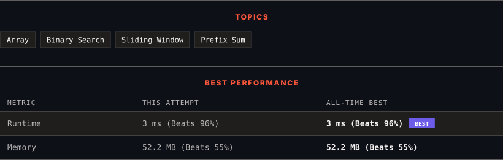

<div align="center">

# 1004. Max Consecutive Ones III

      

[](https://leetcode.com/problems/max-consecutive-ones-iii/)

</div>

---

<div align="center">

<picture>
  <source media="(prefers-color-scheme: dark)" srcset="panel-dark.svg">
  <source media="(prefers-color-scheme: light)" srcset="panel-light.svg">
  
</picture>

</div>

> **New personal best** — Runtime improved on this submission.

### HOW IT WENT

| | |
|:--|:--|
| **Attempts** | first try |
| **Time to solve** | under a minute |
| **Verdicts** | ✅ Accepted |

---

### NOTES

_No notes yet._

---

### SOLUTIONS (1)

| # | File | Language | Date |
|:-:|------|:--------:|:----:|
| 1 | [sol1.java](./sol1.java) | `Java` | 2026-09-16 ← **latest** |

---

### PROBLEM DESCRIPTION

Given a binary array `nums` and an integer `k`, return *the maximum number of consecutive *`1`*'s in the array if you can flip at most* `k` `0`'s.

 

**Example 1:**

```

**Input:** nums = [1,1,1,0,0,0,1,1,1,1,0], k = 2
**Output:** 6
**Explanation:** [1,1,1,0,0,**1**,1,1,1,1,**1**]
Bolded numbers were flipped from 0 to 1. The longest subarray is underlined.
```

**Example 2:**

```

**Input:** nums = [0,0,1,1,0,0,1,1,1,0,1,1,0,0,0,1,1,1,1], k = 3
**Output:** 10
**Explanation:** [0,0,1,1,**1**,**1**,1,1,1,**1**,1,1,0,0,0,1,1,1,1]
Bolded numbers were flipped from 0 to 1. The longest subarray is underlined.

```

 

**Constraints:**

	- `1 <= nums.length <= 10^5`

	- `nums[i]` is either 0 or 1.

	- `0 <= k <= nums.length`

---

<div align="center">

<sub>Auto-synced by <strong>LeetSync</strong> · Built by <a href="https://deveshsamant.in/">Devesh Samant</a></sub>

</div>
