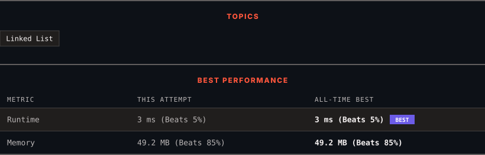

<div align="center">

# 1669. Merge In Between Linked Lists

      

[](https://leetcode.com/problems/merge-in-between-linked-lists/)

</div>

---

<div align="center">

<picture>
  <source media="(prefers-color-scheme: dark)" srcset="panel-dark.svg">
  <source media="(prefers-color-scheme: light)" srcset="panel-light.svg">
  
</picture>

</div>

> **New personal best** — Runtime improved on this submission.

### HOW IT WENT

| | |
|:--|:--|
| **Attempts** | 3 before accepted |
| **Time to solve** | 45 min |
| **Verdicts** | ✅ Accepted → ❌ Wrong Answer → ✅ Accepted |

---

### NOTES

_No notes yet._

---

### SOLUTIONS (2)

| # | File | Language | Date |
|:-:|------|:--------:|:----:|
| 1 | [sol1.java](./sol1.java) | `Java` | 2026-09-15 |
| 2 | [sol2.java](./sol2.java) | `Java` | 2026-09-15 ← **latest** |

---

### PROBLEM DESCRIPTION

You are given two linked lists: `list1` and `list2` of sizes `n` and `m` respectively.

Remove `list1`'s nodes from the `a^th` node to the `b^th` node, and put `list2` in their place.

The blue edges and nodes in the following figure indicate the result:


*Build the result list and return its head.*

 

**Example 1:**


```

**Input:** list1 = [10,1,13,6,9,5], a = 3, b = 4, list2 = [1000000,1000001,1000002]
**Output:** [10,1,13,1000000,1000001,1000002,5]
**Explanation:** We remove the nodes 3 and 4 and put the entire list2 in their place. The blue edges and nodes in the above figure indicate the result.

```

**Example 2:**


```

**Input:** list1 = [0,1,2,3,4,5,6], a = 2, b = 5, list2 = [1000000,1000001,1000002,1000003,1000004]
**Output:** [0,1,1000000,1000001,1000002,1000003,1000004,6]
**Explanation:** The blue edges and nodes in the above figure indicate the result.

```

 

**Constraints:**

	- `3 <= list1.length <= 10^4`

	- `1 <= a <= b < list1.length - 1`

	- `1 <= list2.length <= 10^4`

---

<div align="center">

<sub>Auto-synced by <strong>LeetSync</strong> · Built by <a href="https://deveshsamant.in/">Devesh Samant</a></sub>

</div>
