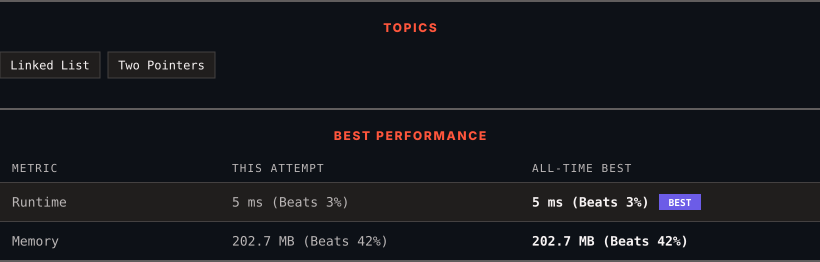

<div align="center">

# 2095. Delete the Middle Node of a Linked List

      

[](https://leetcode.com/problems/delete-the-middle-node-of-a-linked-list/)

</div>

---

<div align="center">

<picture>
  <source media="(prefers-color-scheme: dark)" srcset="panel-dark.svg">
  <source media="(prefers-color-scheme: light)" srcset="panel-light.svg">
  
</picture>

</div>

> **New personal best** — Runtime improved on this submission.

### HOW IT WENT

| | |
|:--|:--|
| **Attempts** | 2 before accepted |
| **Time to solve** | 1 min |
| **Verdicts** | ❌ Wrong Answer → ✅ Accepted |

---

### NOTES

_No notes yet._

---

### SOLUTIONS (1)

| # | File | Language | Date |
|:-:|------|:--------:|:----:|
| 1 | [sol1.java](./sol1.java) | `Java` | 2026-09-14 ← **latest** |

---

### PROBLEM DESCRIPTION

You are given the `head` of a linked list. **Delete** the **middle node**, and return *the* `head` *of the modified linked list*.

The **middle node** of a linked list of size `n` is the `&lfloor;n / 2&rfloor;^th` node from the **start** using **0-based indexing**, where `&lfloor;x&rfloor;` denotes the largest integer less than or equal to `x`.

	- For `n` = `1`, `2`, `3`, `4`, and `5`, the middle nodes are `0`, `1`, `1`, `2`, and `2`, respectively.

 

**Example 1:**


```

**Input:** head = [1,3,4,7,1,2,6]
**Output:** [1,3,4,1,2,6]
**Explanation:**
The above figure represents the given linked list. The indices of the nodes are written below.
Since n = 7, node 3 with value 7 is the middle node, which is marked in red.
We return the new list after removing this node. 

```

**Example 2:**


```

**Input:** head = [1,2,3,4]
**Output:** [1,2,4]
**Explanation:**
The above figure represents the given linked list.
For n = 4, node 2 with value 3 is the middle node, which is marked in red.

```

**Example 3:**


```

**Input:** head = [2,1]
**Output:** [2]
**Explanation:**
The above figure represents the given linked list.
For n = 2, node 1 with value 1 is the middle node, which is marked in red.
Node 0 with value 2 is the only node remaining after removing node 1.
```

 

**Constraints:**

	- The number of nodes in the list is in the range `[1, 10^5]`.

	- `1 <= Node.val <= 10^5`

---

<div align="center">

<sub>Auto-synced by <strong>LeetSync</strong> · Built by <a href="https://deveshsamant.in/">Devesh Samant</a></sub>

</div>
